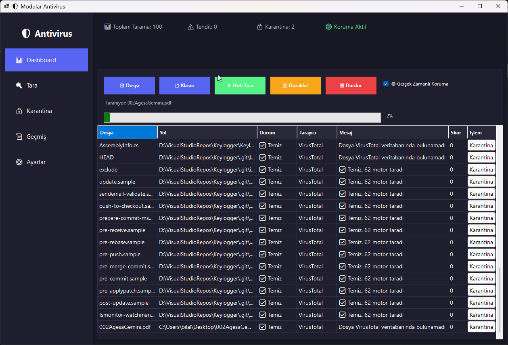
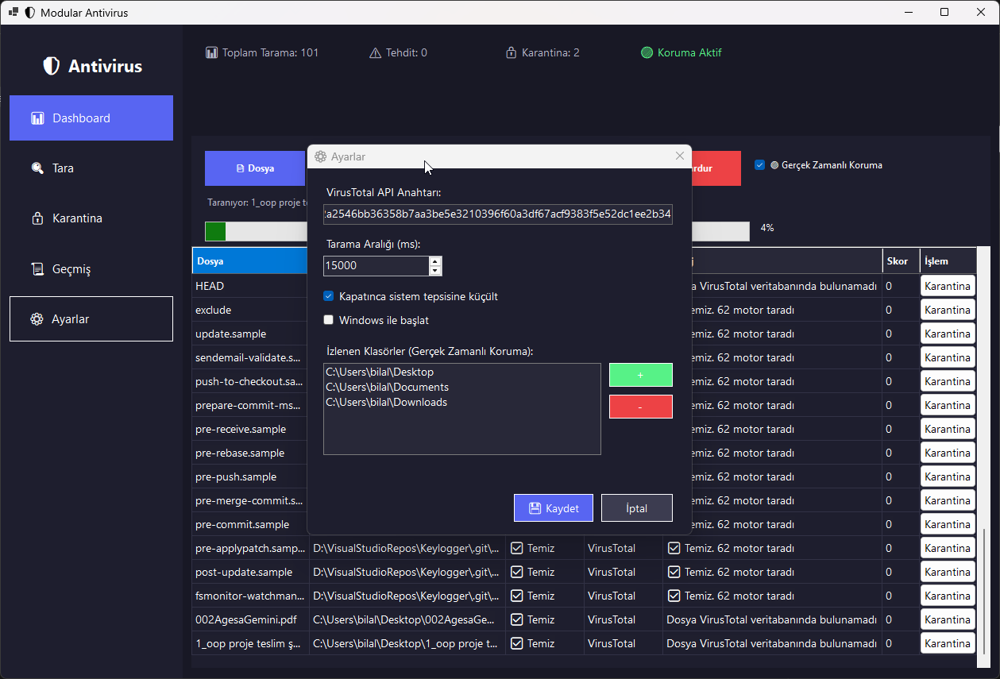

# 🛡️ Modular Antivirus Application

.NET 8 Windows Forms ile geliştirilmiş, modüler ve genişletilebilir bir antivirüs uygulaması.



## 📋 Proje Hakkında

Bu uygulama, dosya ve klasörleri VirusTotal API kullanarak tarar, tehditleri tespit eder ve karantinaya alır. Modüler mimarisi sayesinde yeni tarama motorları kolayca eklenebilir.

## ✨ Özellikler

### 🔍 Tarama Özellikleri
- **Tekli Dosya Tarama** - Seçilen dosyayı tara
- **Klasör Tarama** - Tüm klasör içeriğini recursive tara
- **Hızlı Tarama** - Masaüstü, İndirilenler ve Başlangıç klasörlerini tara
- **Kuyruk Sistemi** - Rate limit dostu, sıralı tarama

### 🔴 Gerçek Zamanlı Koruma
- FileSystemWatcher ile klasör izleme
- Yeni/değişen dosyaları otomatik algılama
- Riskli uzantıları önceliklendirme (.exe, .dll, .bat, .ps1 vb.)

### 🔒 Karantina Sistemi
- Tehlikeli dosyaları izole etme
- Şifreli ZIP olarak güvenli saklama
- Geri yükleme imkanı
- Kalıcı silme seçeneği

### 📊 İstatistikler & Geçmiş
- Toplam tarama sayısı
- Tespit edilen tehditler
- Karantinaya alınan dosyalar
- SQLite veritabanında tarama geçmişi


### ⚙️ Ayarlar
- VirusTotal API anahtarı yönetimi
- Tarama aralığı ayarı (ms)
- İzlenen klasörler listesi
- Sistem tepsisine küçültme
- Windows ile başlatma



### 🎨 Modern Arayüz
- Koyu tema (Discord benzeri)
- Sol sidebar navigasyon
- Progress bar ve yüzde göstergesi
- Renkli durum göstergeleri
- Sistem tepsisi entegrasyonu

## 🏗️ Proje Yapısı

```
AntivirusAppDemo/
├── Engine/
│   └── AntivirusEngine.cs      # Tarama motorlarını yöneten ana sınıf
├── Helpers/
│   └── HashHelper.cs           # SHA256 hash hesaplama
├── Interfaces/
│   └── IScanner.cs             # Tarayıcı interface'i
├── Models/
│   └── ScanResult.cs           # Tarama sonuç modeli
├── Scanners/
│   ├── VirusTotalModels.cs     # API JSON modelleri
│   └── VirusTotalScanner.cs    # VirusTotal API entegrasyonu
├── Services/
│   ├── DatabaseService.cs      # SQLite veritabanı işlemleri
│   ├── QuarantineService.cs    # Karantina yönetimi
│   ├── RealTimeProtectionService.cs  # Gerçek zamanlı koruma
│   └── SettingsService.cs      # Ayarlar yönetimi
├── MainForm.cs                 # Ana form logic
├── MainForm.Designer.cs        # Form tasarımı
├── SettingsForm.cs             # Ayarlar penceresi
└── Program.cs                  # Uygulama giriş noktası
```

## 🔧 Mimari

### Interface Tabanlı Tasarım
```csharp
public interface IScanner
{
    string Name { get; }
    Task<ScanResult> ScanAsync(string filePath);
}
```

### Modüler Engine
```csharp
var engine = new AntivirusEngine();
engine.AddScanner(new VirusTotalScanner(apiKey));
// Gelecekte: engine.AddScanner(new YaraScanner());
// Gelecekte: engine.AddScanner(new ClamAVScanner());

var results = await engine.ScanFileAsync(filePath);
```

## 📦 Gereksinimler

- .NET 8.0 SDK
- Windows 10/11
- Visual Studio 2022 (önerilen)

### NuGet Paketleri
- `Newtonsoft.Json` - JSON işlemleri
- `Microsoft.Data.Sqlite` - Veritabanı

## 🚀 Kurulum

1. **Projeyi klonla**
```bash
git clone https://github.com/kullanici/AntivirusAppDemo.git
cd AntivirusAppDemo
```

2. **Paketleri yükle**
```bash
cd AntivirusAppDemo
dotnet restore
```

3. **Derle ve çalıştır**
```bash
dotnet run
```

## 🔑 VirusTotal API Anahtarı

1. [virustotal.com](https://www.virustotal.com/) adresine git
2. Ücretsiz hesap oluştur
3. Profil → API Key bölümünden anahtarını al
4. Uygulamada Ayarlar → API Anahtarı alanına yapıştır

> **Not:** Ücretsiz hesapta 4 istek/dakika, 500 istek/gün limiti var. Timer 15 saniyeye ayarlı, bu limite uygun.

## 📱 Kullanım

### Temel Tarama
1. **Dosya Seç** butonuna tıkla
2. Taranacak dosya(ları) seç
3. Tarama otomatik başlar
4. Sonuçlar tabloda görünür

### Hızlı Tarama
- **Hızlı Tara** butonu Masaüstü, İndirilenler ve Başlangıç klasörlerini tarar

### Gerçek Zamanlı Koruma
1. **Gerçek Zamanlı Koruma** checkbox'ını işaretle
2. Ayarlarda izlenen klasörleri düzenle
3. Bu klasörlere eklenen yeni dosyalar otomatik taranır

### Karantina
- Tehdit tespit edildiğinde sağ tık → **Karantinaya Al**
- Karantina sekmesinden dosyaları geri yükle veya kalıcı sil

## 🔮 Gelecek Geliştirmeler

- [ ] YARA kuralları desteği
- [ ] Yerel imza tabanlı tarama
- [ ] ClamAV entegrasyonu
- [ ] Çoklu dosya paralel tarama
- [ ] PDF/HTML raporlama
- [ ] Otomatik güncelleme
- [ ] Bulut tabanlı imza veritabanı

## 🛠️ Geliştirme

### Yeni Scanner Ekleme
```csharp
public class MyCustomScanner : IScanner
{
    public string Name => "CustomScanner";
    
    public async Task<ScanResult> ScanAsync(string filePath)
    {
        // Tarama mantığı
        return new ScanResult
        {
            FilePath = filePath,
            IsThreat = false,
            Message = "Temiz",
            ScannerName = Name
        };
    }
}

// Engine'e ekle
engine.AddScanner(new MyCustomScanner());
```

## 📄 Lisans

MIT License - Detaylar için [LICENSE](LICENSE) dosyasına bakın.

## 🤝 Katkıda Bulunma

1. Fork'la
2. Feature branch oluştur (`git checkout -b feature/yeni-ozellik`)
3. Commit'le (`git commit -m 'Yeni özellik eklendi'`)
4. Push'la (`git push origin feature/yeni-ozellik`)
5. Pull Request aç

---

**⚠️ Uyarı:** Bu uygulamayı deneme etmek amacıyla oluşturulmuştur. Gerçek bir antivirüs yazılımının yerini tutamaz.

---

<p align="center">
  <i>🤖 Yapay Zeka yardımıyla oluşturulmuştur (Gemini, Claude ve IDE: Kiro)</i>
</p>
